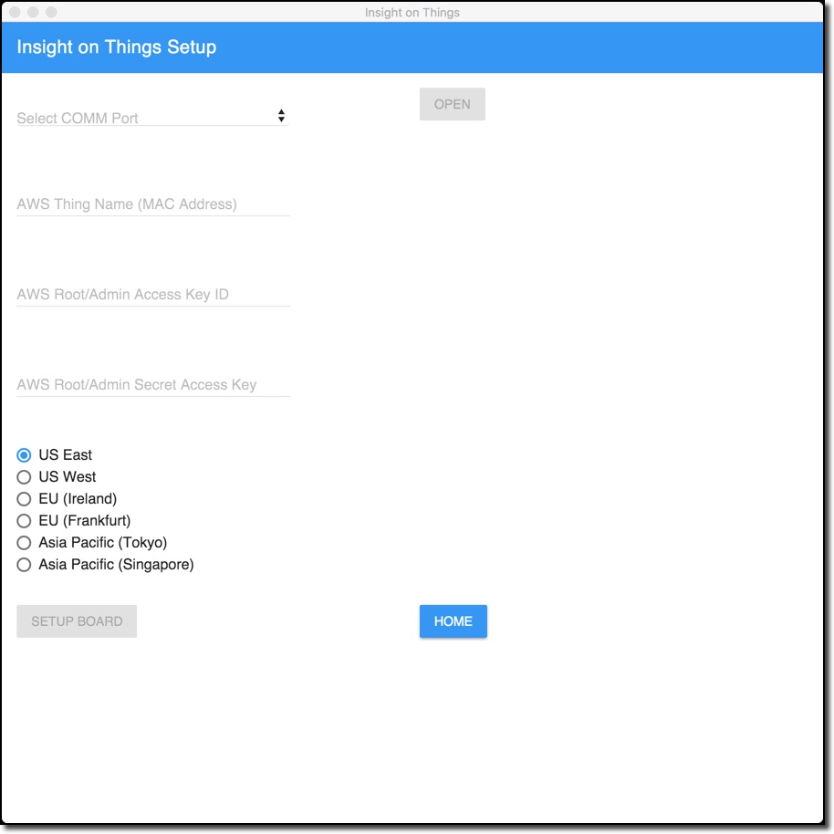
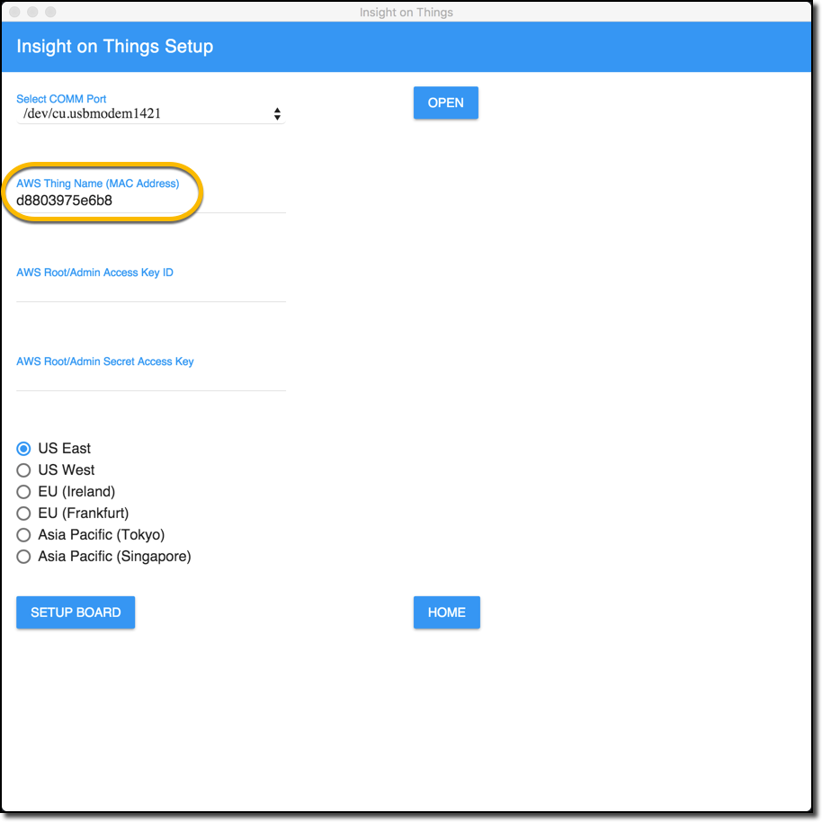
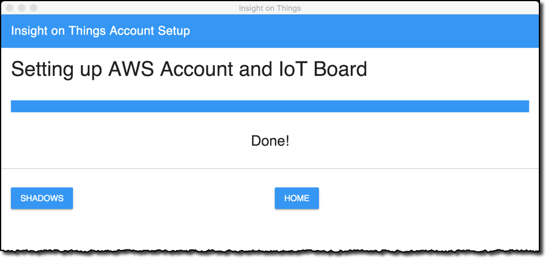
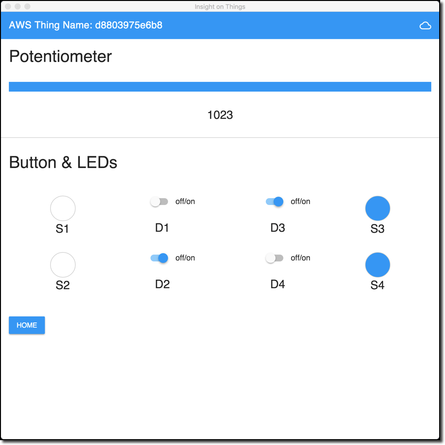

### Insight on Things Desktop Application
#### Out of Box Guide

---

#### Required Tools and Applications
#### Downloading the installer

The first step to running the __Insight on Things__ desktop application is to downoad the current install for your OS.  The installers can be found [here](https://github.com/MicrochipTech/aws-iot-insight-on-things-desktop-app/releases/latest).

We have build and tested the __Insight on Things__ Desktop Application on the following OS's:

OS              | Version
----------------|--------------------------------
OS X & macOS    | 10.11.x or greater
Windows         | Windows 7 (64 bit) and Windows 10 (64 bit)

> NOTE: If you have installed a previous version of the __Insight on Things__ desktop application then you will need to remove the old data file as the format has changed.  Use [these instructions](uninstalling-insight-on-things-desktop-application.md) to remove the _.insight_ file from your computer.

---

### Required AWS Account

To run this demo you will need to have, or have access to, an Amazon Web Service (AWS) account.  To learn more about AWS, click [here](https://aws.amazon.com/).  You should also check with your company's HR and/or IT for policies on using cloud based accounts, or to see if you have a corporate AWS account that should be used.  

Access to this account with admin level is preferred but not required.  To lean how to setup and admin user in AWS see [this tutorial](http://docs.aws.amazon.com/IAM/latest/UserGuide/getting-started_create-admin-group.html).

> NOTE: If you are a __Microchip Employee__ we have a corporate AWS account that must be used.  To setup your AWS IoT device please email iot@microchip.com for more information.

---
### Running the Demo

#### Setting up AWS IoT and configuring the board

1. Connect the target demo board to the computer via USB and power on the board
  - Make sure you have [firmware version 2.0.0](https://github.com/MicrochipTech/aws-iot-firmware-pic32mz/releases/latest) or greater on the target board.
- Open the __Insight on Things__ desktop application
  - The first time that you run the you should see the following setup screen

  
- Select the comm port that belongs to your target device
  - You should see the MAC address of the board automatically fill the second line when you hit the `OPEN` button

  
- Enter the `AWS Access Key ID` and `AWS Secret Access Key` for your AWS account.
- Select what region you would like to setup the board to work in and then click the `SETUP BOARD` action button
  - You will see a progress bar as the AWS account is setup and the board is loaded with the required authentication information (All of this is being done over a TLS connection)
- When this is done you can hit the `SHADOWS` button to interact with your target demo

  

#### Interacting with the target board

1. Once setup has been run on the target board, you now have a fully connect and secure connection to AWS IoT

  
  - Changing the potentiometer on the target board will cause the bar graph on the __Insigt on Things__ desktop application to change
  - Pressing buttons on the board will cause the corresponding indicator on the __Insight on Things__ desktop application to light up blue
  - Changing an LED on the __Insight on Things__ desktop application will turn on the corresponding LED on the board

---
### Troubleshooting
If you are having trouble connecting with AWS IoT and your thing, check to make sure that each of the issues bellow are resolved.

#### Connection Issue
- Check that you have a valid internet connection on your network/access point.
- Ensure that port 443 is open on your network/access point.

#### Target board LED codes
- If you have two solid blue lights on your target board, see the  [Status and Error Codes Table](https://github.com/MicrochipTech/aws-iot-firmware-pic32mz/blob/master/documents/iot-ethernet-out-of-box-guide.md#status-and-error-code-table) for the target board
